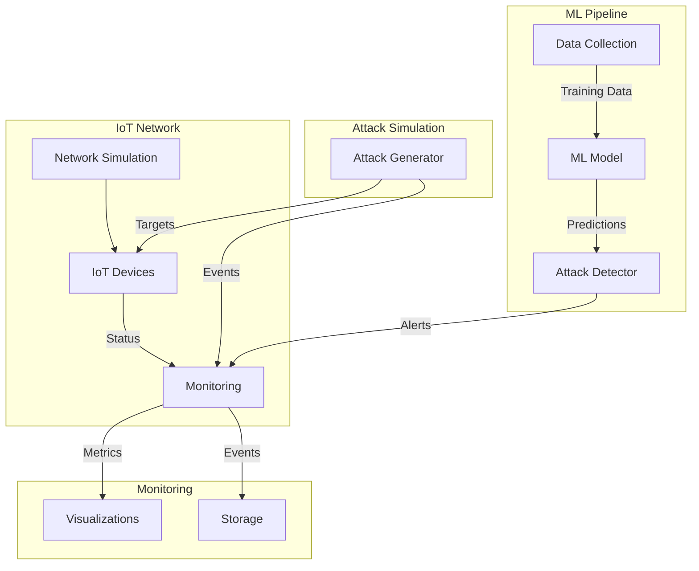

# IoT Security Implementation Summary

## System Architecture



## Implemented Components

### 1. IoT Network Simulation
- Smart home network with 3 device types
- Configurable device properties and vulnerabilities
- Network state monitoring and metrics collection

### 2. Attack Simulation
- Botnet attack implementation
- Malware propagation simulation
- Attack event generation and logging

### 3. Machine Learning Pipeline
- Data collection from network and attack events
- RandomForest classifier for attack detection
- Real-time classification with confidence scoring
- Pattern recognition and severity assessment

### 4. Monitoring & Visualization
- Real-time attack alerts dashboard
- Device targeting analysis
- Attack success rate tracking
- Event storage and retrieval

## Running the System

1. Collect Training Data:
```bash
python src/ml/collect_training_data.py
```

2. Start Monitoring:
```bash
python src/monitoring/run_monitoring.py
```

3. Run Attack Simulation:
```bash
python src/run_attack_simulation.py
```

## Next Steps

1. Test and Validation
   - Run comprehensive attack scenarios
   - Validate ML model performance
   - Test real-time detection accuracy

2. Potential Enhancements
   - Add more attack types (DDoS, MitM)
   - Implement advanced feature engineering
   - Add network topology visualization
   - Enhance alert notification system

3. Documentation
   - Add API documentation
   - Create user guide
   - Document attack patterns and signatures